# Fab Furry Friends

Fab Furry Friends is a fictional a dog rescue organisation created for Portfolio Project #5 (Advanced Front End) - Diploma in Full Stack Software Development at the Code Institute.  The website will be a tool for the rescue to help rehome dogs by providing the ability to create adverts for dogs that are currently looking for homes and by allowing users to search and express an interest in adopting a particular dog.

## CONTENTS

- [Backend API and Frontend Combined](#backend-api-and-frontend-combined)
- [Strategy](#strategy)
    - [Project Goals](#project-goals)
    - [Agile Planning](#agile-planning)
- [Scope](#scope)
    - [User Stories](#user-stories)
- [Structure](#structure)
    - [Features](#features)
    - [Database Design](#database-design)
    - [Reusable React Components](#reusable-react-components)
- [Skeleton](#skeleton)
    - [Wireframes](#wireframes)
- [Surface](#surface)
    - [Colour Scheme](#colour-scheme)
    - [Typography](#typography)
- [Tools and Technologies Used](#tools-and-technologies-used)
    - [Installed Packages](#installed-packages)
- [Testing and Bugs](#testing-and-bugs)
- [Deployment](#deployment)
    - [Heroku Deployment - Combined Project Set Up](#heroku-deployment-combined-project-set-up)
    - [Creating the Django Project](#creating-the-django-project)
    - [Set up Environment Variables](#set-up-environment-variables)
    - [Setting up settings.py](#setting-up-settings-py)
    - [Heroku Deployment](#heroku-deployment)
    - [Deploy on Heroku](#deploy-on-heroku)
    - [Fork the repository](#fork-the-repository)
    - [Clone the repository](#clone-the-repository)
- [Github](#github)
    - [To fork the repository on Github](#to-fork-the-repository-on-github) 
    - [To clone the repository on Github](#to-clone-the-repository-on-github)
- [Credits](#credits)
    - [Content](#content)
    - [Media](#media)
    - [Code](#code)
- [Acknowledgments](#acknowledgements)

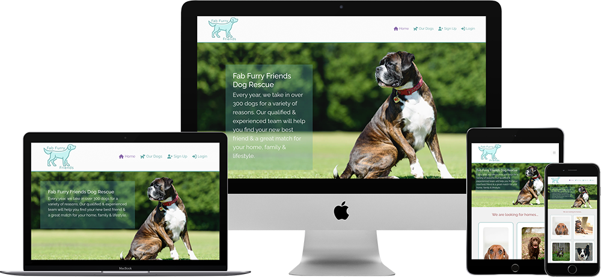

[The deployed project can be accessed here](https://fabfurryfriends-434f21232ed9.herokuapp.com/)

## Backend AP and Frontend Combined

This project was created by combining the Django Rest Framework and React Frontend. The benefits of creating the project in this way are: 

-   CORS will no longer be an issue as requests and responses will come from a shared base URL, both in the development and production environments.

-   Debugging is made significantly easier as terminal logs for the API will be visible while interacting with the React side of the project in development.

-   Work on the development versions of both the API and React project can be done simultaneously.

-   With the front and back end applications on the same domain, Cookies containing the JSONWebToken) required for authentication will not be blocked from being set on browsers that currently have cross-site tracking protection enabled by default. This change will allow authentication and authorisation to run in these browsers without errors.

## Strategy
### Project Goals
Fab Furry Friends is aimed at anyone looking to adopt a rescue dog. The site aims to bring dogs and potential owners together through the use of adverts and user profiles, whilst providing a good user experience.

### Agile Planning
This project was developed using the Agile methodology by delivering small features in incremental sprints. All user stories were assigned to epics, which in turn were assigned to sprints. Each user story was prioritised by the labels "Must have", "Should have" and "Could have". This method ensures that all important core requirements were completed first, with features labelled "Could have" being added should there be capacity.

All progress of epics and user story implementation was registered using GitHub and can be found [here](https://github.com/users/MichelleBritton/projects/5/views/1). As the user stories were accomplished, they were moved in the GitHub Kanban board from To Do, to In Progress, Done and Not Implemented lists.

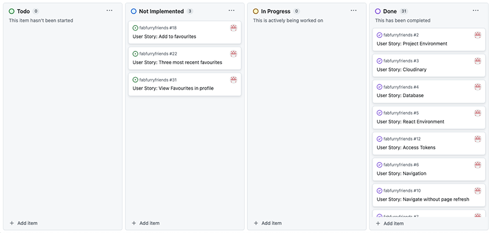

## Scope
### User Stories

| EPIC                       | ID | USER STORY|
|----------------------------|----|-----------|
|**Initial Setup Backend**   |    |           |
|                            | 1A |As a developer, I need to create the project environment so that it is ready for development|
|                            | 1B |As a developer, I need to create a Cloudinary account and connect it to the project so that static images can be uploaded|
|                            | 1C |As a developer, I need to create an ElephantSQL account to manage the database|
|**Initial Setup Frontend**  |    |           |
|                            | 1D |As a developer, I need to create the React environment so that it is ready for development|
|                            | 1E |As a user, I want the navigation to be clear and visible on every page so that I can easily navigate between pages|
|                            | 1F |As a logged out user, I can see the sign up and login options so that I can login and sign up|
|                            | 1G |As a logged in user, I can see the logout option so that I can logout easily|
|                            | 1H |As a logged in user, I can see the profile option so that I can easily navigate to that page|
|                            | 1I |As a user, I can navigate through pages quickly so that I can view content seamlessly without page refresh|
|**Authentication Backend**  |    |           |
|                            | 2A |As a user I can create a new account so that I can access all features for signed up users|
|                            | 2B |As a user I can retain my logged in status until I choose to log out so that my user experience is not interfered with|
|**Authentication Frontend** |    |           |
|                            | 2C |As a user I can sign in so that I can access the functionality for logged in users|
|                            | 2D |As a user, I can easily see if I am logged in or not so that I can log in to access all features|
|**Advert Page Backend**     |    |            |
|                            | 3A |As a logged in admin user, I can create an advert|
|                            | 3B |As a logged in admin user, I can view, edit and delete adverts|
|**Advert Page Frontend**    |    |            |
|                            | 3C |As a logged in admin user, I can create an advert|
|                            | 3D |As a user, I can view the advert page so that I can find out what dogs are available|
|                            | 3E |As a logged in user, I can add a dog to my favourites so that I can easily keep track of the dogs that I am interested in|
|                            | 3F |As a user I can easily navigate back to the Adverts List page so that I can continue looking at all the adverts|
|                            | 3G |As a user I can view all of the adverts, ordered by most recently created so that I am up to date with the newest content|
|                            | 3H |As a user I can filter the adverts by keywords so that I can find the dogs that I am most interested in|
|                            | 3I |As a logged in user, I can see a list of the three most recent dogs that I have added to my favourites so that I can quickly see which ones I have like most recently|
|                            | 3J |As a user I can continuously scroll through all of the adverts so that I don’t have to navigate through pagination links|
|                            | 3K |As a logged in user, I can express my interest in adopting a dog|
|                            | 3L |As a logged in admin user, I can view profiles who have expressed an interest in adopting a dog|
|**Profile Page Backend**    |    |            |
|                            | 4A |As a developer, I can create a new blank profile with a default image when a user is created|
|                            | 4B |As a logged in admin user, I want to be able to view profiles to find out more about them to see if they are a match to the dog|
|**Profile Page Frontend**   |    |            |
|                            | 4C |As a logged in user, I can view my own profile information to ensure that it is up to date and correct|
|                            | 4D |As a logged in user, I can edit my profile to ensure that the information is up to date and correct|
|                            | 4E |As a logged in user, I can update my username and password so that I can change my display name and keep my profile secure|
|                            | 4F |As a logged in user I can view the dogs I have add to my favourites so I can keep track of them|
|                            | 4G |As a logged in user I can remove dogs from my favourites list if I am no longer interested in them|
|**Home Page Frontend**      |    |            |
|                            | 5A |As a user, I can view the relevant information about the rescue so that I immediately know the purpose of the website|
|                            | 5B |As a user, I can easily find contact information so that I can contact the rescue|
|                            | 5C |As a user, I can see a selection of dogs available for adoption|

## Structure
### Features

**Initial Setup:** 

`1A. As a developer, I need to create the project environment so that it is ready for development`

Implementation: 
Django was installed together with all necessary packages, frozen into the requirements file.  The relevant settings were edited and an env file created to hide the secret variables to ensure that the environment was ready for development in both dev and production.

`1B. As a developer, I need to create a Cloudinary account and connect it to the project so that static images can be uploaded`

Implementation:
A Cloudinary account was created to allow image uploading and necessary changes made to settings.py and env.py to connect it.

`1C. As a developer, I need to create an ElephantSQL account to manage the database`

Implementation:
An ElephantSQL account was created together with a database and necessary changes made to settings.py and env.py to connect it.

`1D. As a developer, I need to create the React environment so that it is ready for development`

Implementation:
A new folder called frontend was created within the Django project. Inside that folder a new React project was created. All necessary changes were made to setup the Django project for development and to connect React to it.

`1E. As a user, I want the navigation to be clear and visible on every page so that I can easily navigate between pages`

Implementation:
A NavBar component was created and imported into App.js together with necessary styling and Font Awesome icons. The navigation is responsive by way of a hamburger button so that the navigaton is collapsed on smaller devices and expanded on larger devices.

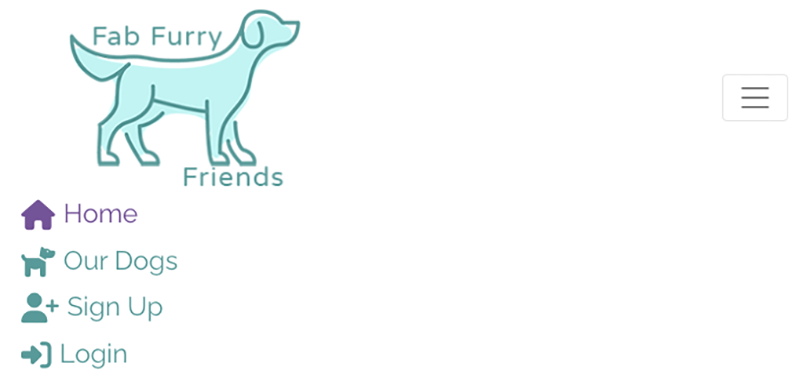

`1F. As a logged out user, I can see the sign up and login options so that I can login and sign up`

Implementation:
Sign up and Login links were added to the navigaton by way of a variable called loggedOutIcons and a currentUserContext was created so that checks could be made to detect whether a user was logged out and display the variable.

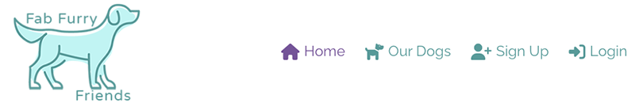

`1G. As a logged in user, I can see the logout option so that I can logout easily`

Implementation:
A logout link was added to the navigation by way of a variable called loggedInIcons and a currentUserContext was created so that checks could be made to detect whether a user was logged in and display the variable.

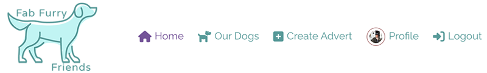

`1H. As a logged in user, I can see the profile option so that I can easily navigate to that page`

Implementation:
A profile link was added to the navigation by way of a variable called loggedInIcons and a currentUserContext was created so that checks could be made to detect whether a user was logged in and display the variable.

`1I. As a user, I can navigate through pages quickly so that I can view content seamlessly without page refresh`

Implementation:
React Router was installed and routes were set up to allow a seamless navigation throughout the site.

**Authentication:**

`2A. As a user I can create a new account so that I can access all features for signed up users`

Implementation:
Django Rest Framework was installed, together with dj_rest_auth to make use of their built in authentication system.

`2B. As a user I can retain my logged in status until I choose to log out so that my user experience is not interfered with`

Implementation:
JSON Web Token authentication was added

`2C. As a user I can sign in so that I can access the functionality for logged in users`

Implementation:
A login page was created to include a form so that users can login using their email and password.

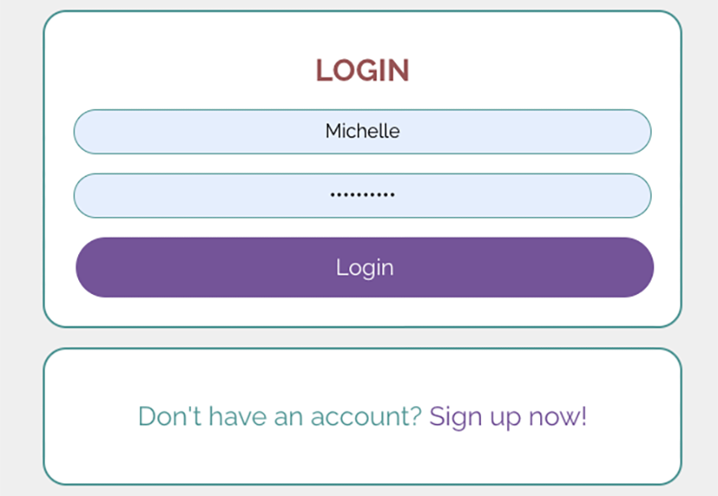

`2D. As a user, I can easily see if I am logged in or not so that I can log in to access all features`

Implementation:
A user's logged in status will be clearly shown in the navigation. If the user is logged in, profile and logout links are visible. If they are logged out, login and sign up links are visible.

`3A As a logged in admin user, I can create an advert`

Implementation:
Adverts are the main feature of the site. Each advert contains the following fields: Dog Name, Breed, Age, Sex, Quick Fact 1, Quick Fact 2,
Quick Fact 3, Quick Fact 4, Quick Fact 5, Content, Image.

An Adverts app was created and the necessary model, view and serializer files implemented resulting in an endpoint of api/adverts. When attempting to create an advert, a check is made to determine whether or not the user is admin and if they are not it will result in a PermissionDenied error.

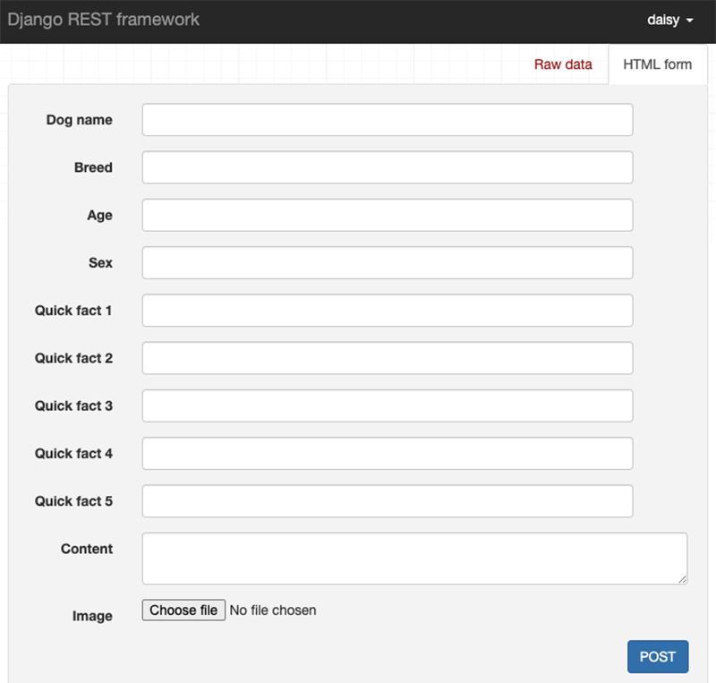

`3B As a logged in admin user, I can view, edit and delete adverts`

Implementation:
The advert list and advert detail were created using the Generics ApiView classes and a permission class added to check whether the user is an admin user and therefore allowing them to edit or delete an advert.

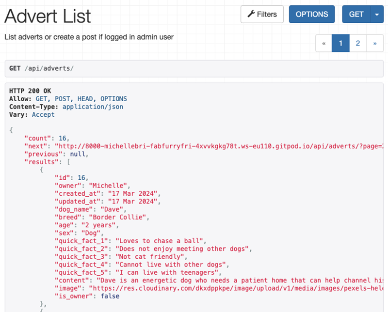

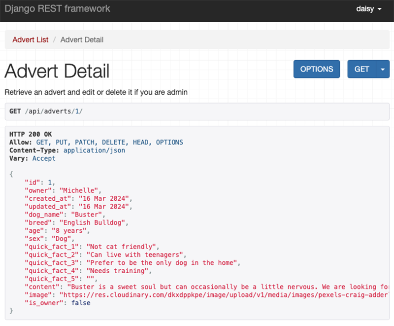

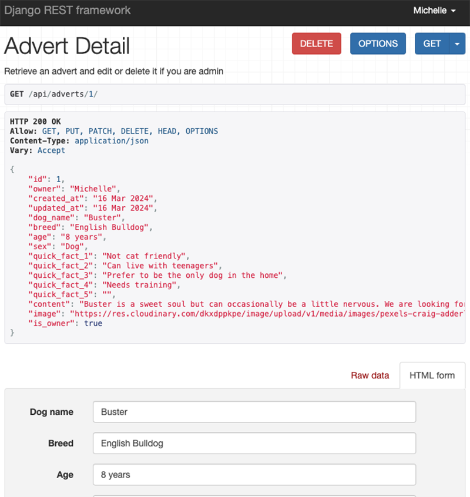

`3C As a logged in admin user, I can create an advert`

Implementation:
When an admin user is logged in, a 'Create Advert' link is included in the navigation. This link takes you to the create advert page where users can upload an image, and complete all fields contained in the model, above. The create button will post the advert and the the user will be notified whether the action was successful or not. The cancel button will take the user back to the previous page they were on.

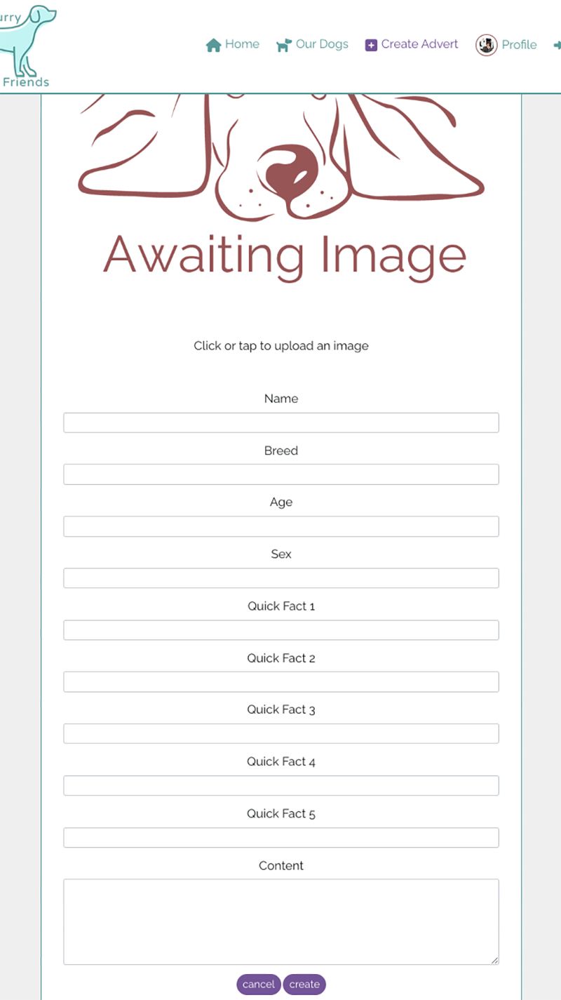

`3D As a user, I can view the advert page so that I can find out what dogs are available`

Implementation:
All users can view adverts regardless of logged in status. A GET request is made to the api/adverts endpoint and the advert component is rendered for each advert, displaying the image and dog's name. Clicking on the dog's name will take you to the advert detail page where all fields contained in the model are rendered.

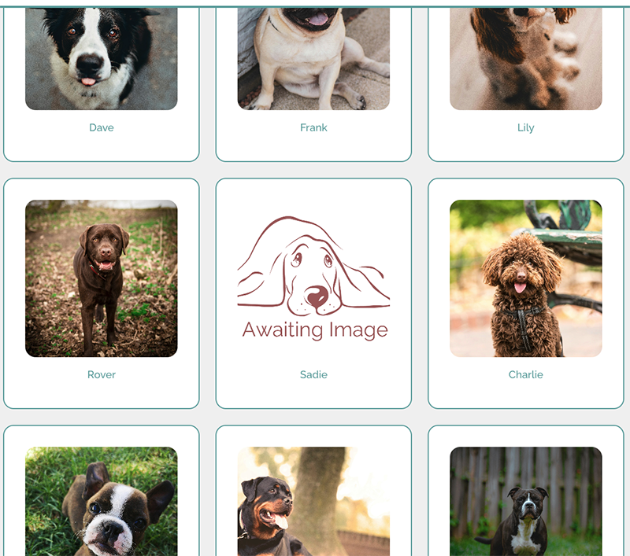

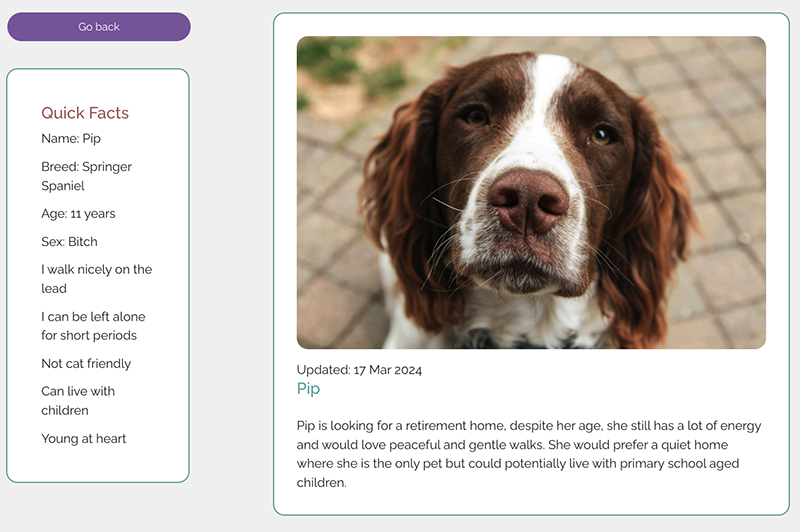

`3F As a user I can easily navigate back to the Adverts List page so that I can continue looking at all the adverts`

Implementation: 
A back button has been added to the advert detail page, using history to go back to the previous page.

`3G As a user I can view all of the adverts, ordered by most recently created so that I am up to date with the newest content`

Implementation:
A Meta class was added to the adverts model to indicate that adverts should be ordered by most recently created.

`3H As a user I can filter the adverts by keywords so that I can find the dogs that I am most interested in`

Implementation:
Filters were set up in the API to allow adverts to be filtered by dog name, breed and content. On the frontend, a search input box is located on the adverts page, to the left hand side and a GET request made to the api/adverts endpoint with the value of the search query.

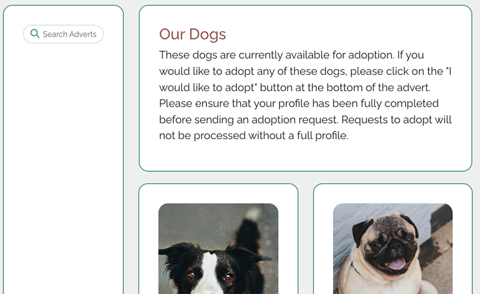

`3J As a user I can continuously scroll through all of the adverts so that I don’t have to navigate through pagination links`

Implementation:
Pagination has been added to settings.py to show 12 adverts per page and Infinite Scroll has been employed to handle the continuous scroll element on the frontend.

`3K As a logged in user, I can express my interest in adopting a dog`

Implementation:
When viewing a specific dog, a button is visible to logged in users only, which users can click on to register their interest. A message will pop up to indicate success/failure. If the request was successful a POST request will be made to the api/adoptors endpoint.

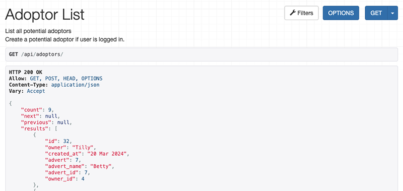

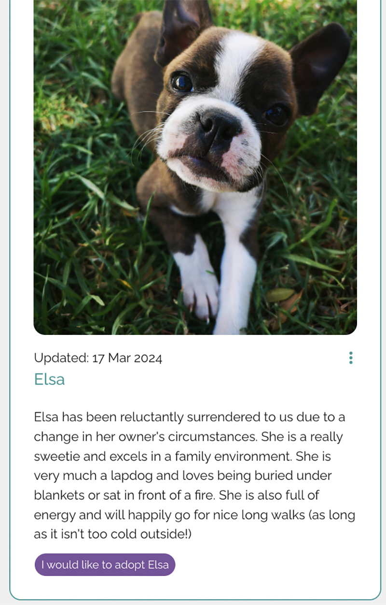

`3L As a logged in admin user, I can view profiles who have expressed an interest in adopting a dog`

Implementation:
Checks are made to see if the current user is an admin user, if so, an adoption requests panel will be visible on the advert detail page which will show the avatar and name of each profile who would like to adopt that particular dog.

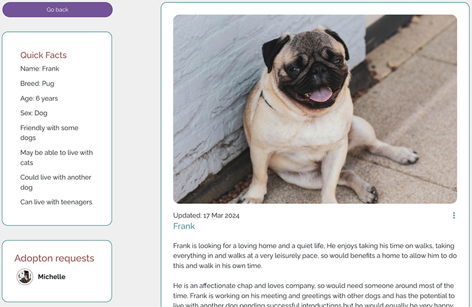

`4A As a developer, I can create a new blank profile with a default image when a user is created`

Implementation:
When creating the Profile model, Signals have been used to ensure that when a new user is created the profile model is also implemented and associated with that user.

`4B As a logged in admin user, I want to be able to view profiles to find out more about them to see if they are a match to the dog`

Implementation:
When creating the Profile Detail view, the isOwnerOrAdmin permission class has been applied to it so that the profile is only visible to the profile owner and admin users to ensure the security of personal details. The necessary checks have also been made on the frontend.

`4C As a logged in user, I can view my own profile information to ensure that it is up to date and correct`

Implementation:
As above, when creating the Profile Detail view, the isOwnerOrAdmin permission class has been applied to it so that the profile is only visible to the profile owner and admin users to ensure the security of personal details. The necessary checks have also been made on the frontend.

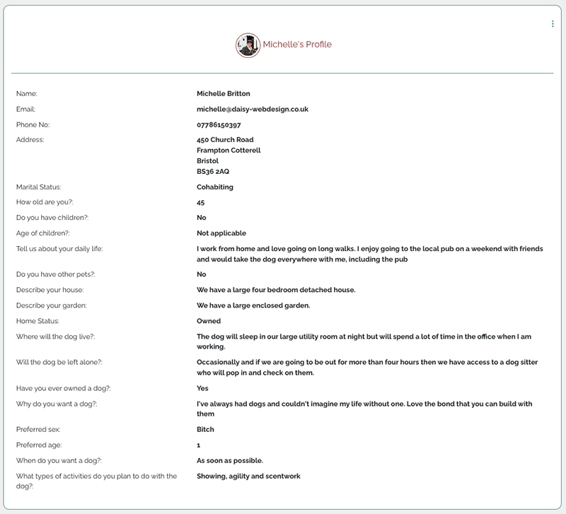

`4D As a logged in user, I can edit my profile to ensure that the information is up to date and correct`

`4E As a logged in user, I can update my username and password so that I can change my display name and keep my profile secure`

Implementation:
As above, checks are made to ensure that the current user is the profile owner, and if so, three dots will appear to the right of the profile name which can be clicked on to reveal a dropdown menu to allow users to edit profile, username and password.

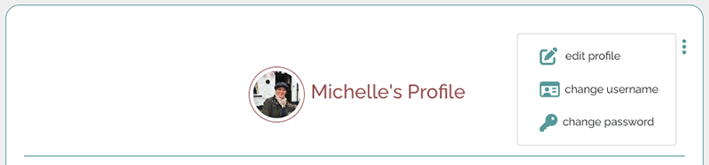

`5A As a user, I can view the relevant information about the rescue so that I immediately know the purpose of the website`

Implementation:
The main focal point of the home page is a large banner showing a dog. There is an overlay panel on top containing a brief explanation about the organisation.

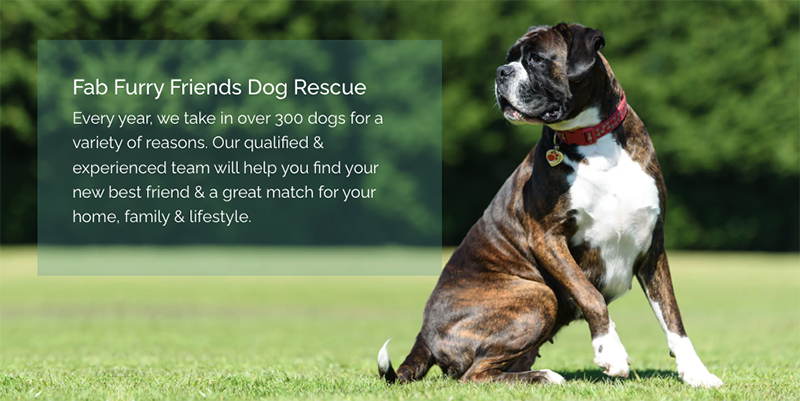

`5B As a user, I can easily find contact information so that I can contact the rescue`

Implementation:
A footer component has been created to hold this information and is visible on every page.

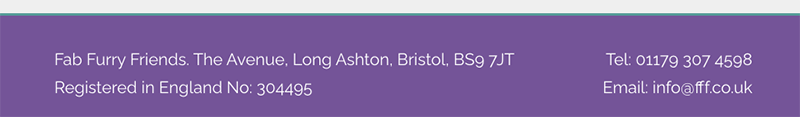

`5C As a user, I can see a selection of dogs available for adoption`

Implementation: 
A GET request is made to the api/adverts endpoint, the results are then shuffled and the first four adverts from the shuffled results are shown on the home page so that a random selection of dogs are shown each time rather than the four newest adverts.

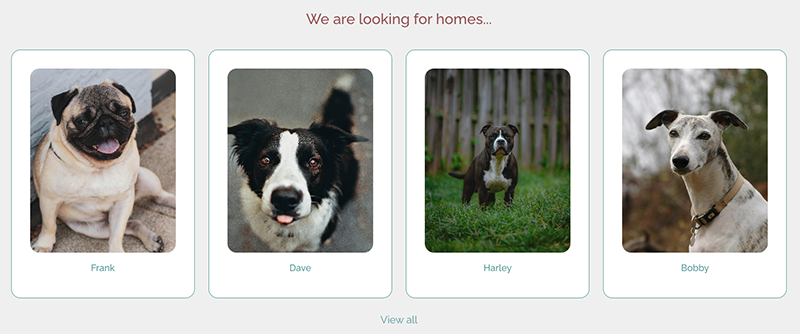

`3E As a logged in user, I can add a dog to my favourites so that I can easily keep track of the dogs that I am interested in`

`3I As a logged in user, I can see a list of the three most recent dogs that I have added to my favourites so that I can quickly see which ones I have like most recently`

`4F As a logged in user I can view the dogs I have add to my favourites so I can keep track of them`

`4G As a logged in user I can remove dogs from my favourites list if I am no longer interested in them`

Implementation:
The favourites section has not been implemented and will be considered as a future feature.

### Database Design
**!!!!!!!! NEED DAISY'S HELP TO SORT THIS !!!!!!!!!!!!!!!!!**

### Reusable React Components

Reusable React components are self-contained, modular pieces of UI that can be used and reused across different parts of an application. They promote code reusability, maintainability, and consistency in design. Here are the ones I have used within my project:

-   Navbar.js
-   Asset.js
-   Avatar.js
-   Footer.js
-   NotFound.js
-   MoreDropdown.js

## Skeleton
### Wireframes
Figma was used to create wireframes for both mobile and desktop.

#### Home

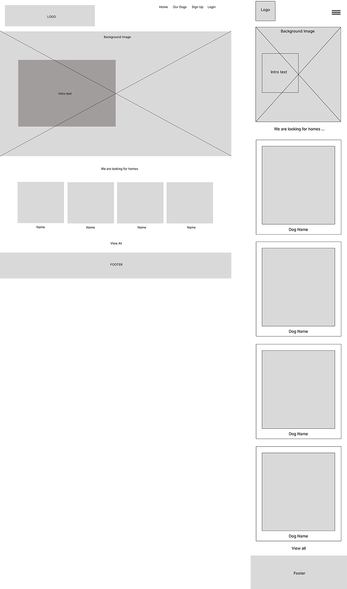

#### Adverts Page

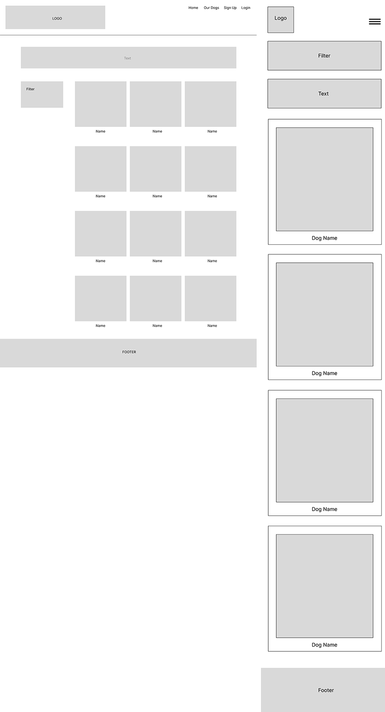

#### Advert Detail Page

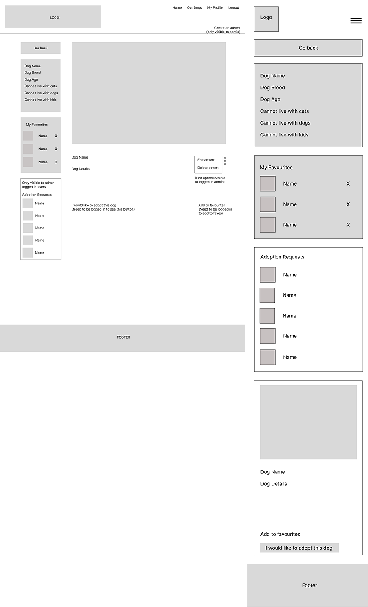

#### Create/Edit Advert

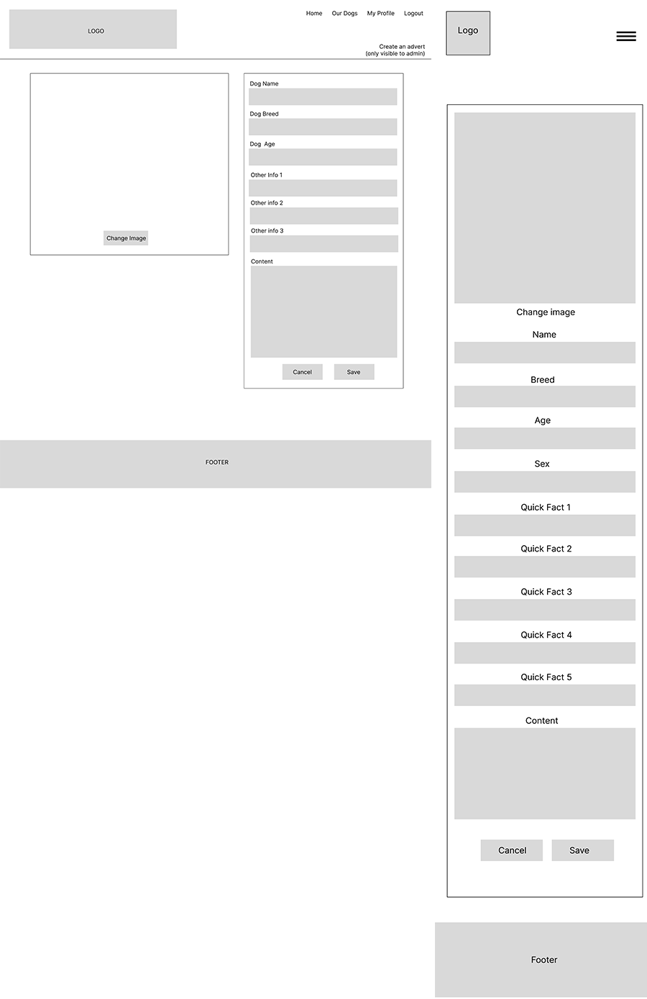

#### Sign Up

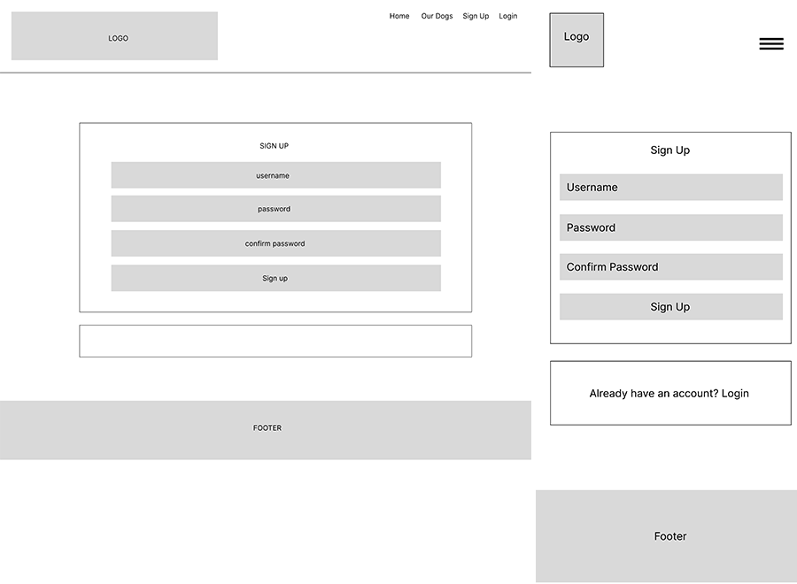

#### Login

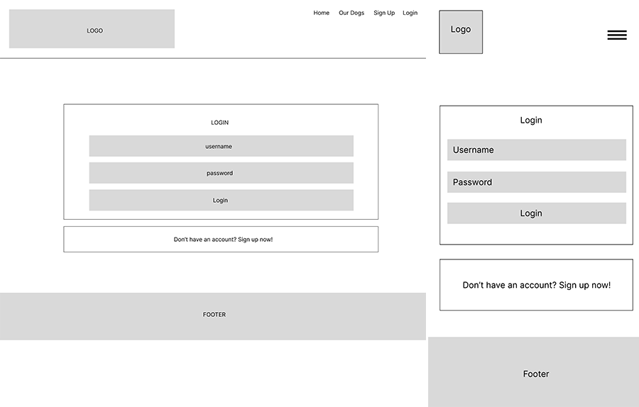

#### Profile

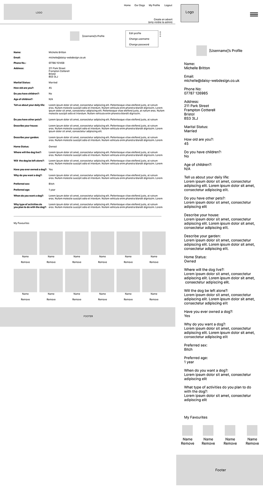

#### Edit Profile

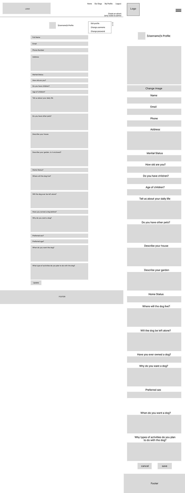

## Surface
### Colour Scheme
I used the logo colour as a base to create a colour palette using Adobe Colour.

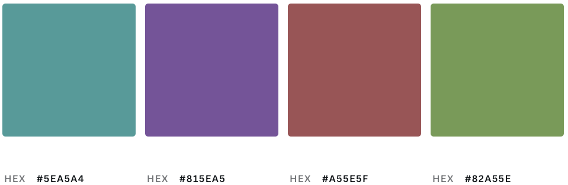

### Fonts
The following font was used for this project which was imported from Google Fonts. 

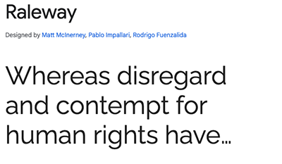

## Tools and Technologies Used
- HTML - used for static content
- CSS - used for site styling
- Javascript - used for page interactivity
- [React](https://react.dev/) - a JavaScript based UI development library
- [React Bootstrap](https://react-bootstrap.netlify.app/) - a CSS Framework for developing responsive and mobile first websites
- [Node](https://nodejs.org/en) - package manager used to install dependencies
- [Toastify](https://www.npmjs.com/package/react-toastify?activeTab=versions) - used to create toast messages
- Python - used as backend programming language
- [Django](https://www.djangoproject.com/) - a Python framework
- [Django Rest Framework](https://www.django-rest-framework.org/) - a Python framework used for building APIs
- [Cloudinary](https://cloudinary.com/) - for storing static images
- [Elephant SQL](https://www.elephantsql.com/) - PostgresSql database

- [Git](https://git-scm.com/) - a version control system for tracking changes
- [GitHub](https://github.com/) - a code hosting platform for version control
- [Gitpod](https://www.gitpod.io/) - a cloud development environment
- [Heroku](https://www.heroku.com) - for deployment of the project

- [Figma](https://www.figma.com/) - for creating wireframes
- [Google Fonts](https://fonts.google.com/) - catalogue of open source fonts
- [TinyPNG](https://tinypng.com/) - to compress images
- [Favicon.io](https://favicon.io/) - to generate the favicon
- [Font Awesome](https://fontawesome.com/) - to add icons 
- [Am I Responsive?](https://ui.dev/amiresponsive) - to generate a screenshot of the website on multiple devices
- [Shields](https://shields.io/) - to generate badges for inclusion in the README field

- [Chrome Developer Tools](https://developer.chrome.com/docs/devtools/) - for testing and debugging the website
- [Lighthouse](https://developer.chrome.com/docs/lighthouse/overview/) - for accessibility and performance reporting
- [WAVE](https://wave.webaim.org/) - for further accessibility testing
- [The W3C Markup Validation Service](https://validator.w3.org/) - for validating HTML 
- [Jigsaw](https://jigsaw.w3.org/css-validator/) - for validating CSS
- [JSHint](https://jshint.com/) - for validating JavaScript
- [PEP8 Validator](https://pep8ci.herokuapp.com/) - for validating the python code
- [Browserstack](https://www.browserstack.com/) - for cross browser testing

### Installed Packages
- asgiref - ASGI is a standard for Python asynchronous web apps and servers to communicate with each other, and positioned as an asynchronous successor to WSGI.
- black - a PEP 8 compliant formatter
- click - a Command Line Interface
- cloudinary - media management
- dj-database-url - used to parse database url for production environment
- dj-rest-auth - Drop-in API endpoints for handling authentication securely in Django Rest Framework
- django-allauth - - authentication system for login, register, logout etc
- django-cloudinary-storage - Cloudinary storage
- django-filter - installed to use djangofilterbackend
- djangorestframework-simplejwt - JSON Web Token authentication plugin for DRF
- gunicorn - a Python WSGI HTTP Server
- httpie - command-line HTTP client created for interacting with HTTP servers and APIs.
- pathspec - a utility library for pattern matching of file paths
- pillow - image processing capibilities
- psycopg2 - used for database connections
- PySocks - send traffic through SOCKS and HTTP proxy servers
- whitenoise - allows web apps to serve their own static files 

## Testing
The testing documentation can be found at [TESTING.md](TESTING.md)

## Deployment
### Deploy on Heroku
The site was deployed to Heroku using the following steps:

- Navigate to heroku.com and create an account
- Click the "New" button in the top right corner
- Select "Create new app"
- Enter the app name
- Select Region and click "Create app"
- Go to the Settings tab and click "Reveal config vars"
- Add any necessary config vars
- Click the Deploy tab
- Scroll down to Connect to GitHub and sign in / authorize when prompted
- Find the repository you want to deploy and click "Connect"
- Scroll down to Manual deploy and choose the main branch
- Click "Deploy Branch"
- The app should now be deployed and you can click on the "View" button to view the live site

### Fork the repository
Forks are used to either propose changes to someone else's project or to use someone else's project as a starting point for your own idea.

- Navigate to the GitHub Repository you want to fork
- On the top right of the page under the header, click the "Fork" button
- This will create a duplicate of the full project in your GitHub Repository.

### Clone the repository
Navigate to the GitHub Repository you want to clone:

- Click on the "Code" drop down button
- Click on HTTPS
- Copy the repository link to the clipboard
- Open your IDE of choice (git must be installed for the next steps)
- Type git clone copied-git-url into the terminal
- The project will now have been cloned on your local machine for use.

## Credits
### Content
- The content of the website is fictional but inspiration for adverts was taken from various sites.

### Media
- All images were purchased from [iStock](https://www.istockphoto.com/) or downloaded for free from [Pexels](https://pexels.com/)

### Code
- Code Institute's learning material which has been used as a base for this project
- https://stackoverflow.com/questions/57992640/how-to-show-content-to-staff-user-only-using-react-and-drf
- https://stackoverflow.com/questions/6274339/how-can-i-shuffle-an-array

## Acknowledgements

I would like to acknowledge the tutors from Code Institute's Tutor Support for helping me solve some of the issues I faced together with my mentor, Daisy.