# Testing

Back to [README.MD](README.MD)

## CONTENTS

- [Manual Testing](#manual-testing)
- [Browser Testing](#browser-testing)
- [Validator Testing](#validator-testing)
- [Accessibility Testing](#accessibility-testing)
- [Bugs](#bugs)

## Manual Testing

**Navigation (any auth)**
| **Testing**            | **Action**            | **Expected**                | **Outcome**          |
|------------------------|-----------------------|-----------------------------|----------------------|
|Logo                    |Click on logo          |Loads home page              |As expected           |
|Home                    |Click on Home          |Loads home page              |As expected           |
|Our Dogs                |Click on Our Dogs      |Loads the adverts page       |As expected           |

**Navigation (Logged Out)**
| **Testing**                       | **Action**            | **Expected**                | **Outcome**          |
|-----------------------------------|-----------------------|-----------------------------|----------------------|
|Sign Up                            |Click on Sign Up       |Loads the sign up page       |As expected           |
|Login                              |Click on Login         |Loads the login page         |As expected           |
|Create Advert                      |View page              |Not visible                  |As expected           |
|Profile                            |View page              |Not visible                  |As expected           |
|Logout                             |View page              |Not visible                  |As expected           |

**Navigation (Logged In)**
| **Testing**                       | **Action**            | **Expected**                            | **Outcome**          |
|-----------------------------------|-----------------------|-----------------------------------------|----------------------|
|Create Advert in NavBar            |Click on Create Advert |Loads the create advert page             |As expected           |
|Profile in NavBar                  |Click on Profile       |Loads the profile page                   |As expected           |
|Logout in NavBar                   |Click on Logout        |Logs user out and redirects to home page |As expected           |

**Home Page (Any auth)**
| **Testing**                       | **Action**                 | **Expected**                          | **Outcome**          |
|-----------------------------------|----------------------------|---------------------------------------|----------------------|
|Four random adverts                |Refresh page multiple times |Selection of adverts change on refresh |As expected           |
|Dog name link                      |Click on dog name           |Loads advert detail page               |As expected           |
|View all link                      |Click on link               |Loads the adverts page                 |As expected           |
|Email link in footer               |Click on link               |Opens up an email client               |As expected           |

**Our Dogs Page (Any auth)**
| **Testing**        | **Action**      | **Expected**                                                                   | **Outcome**          |
|--------------------|-----------------|--------------------------------------------------------------------------------|----------------------|
|Adverts are visible |View page        |12 adverts are initially displayed in descending order based on created date    |As expected           |
|Infinite scroll     |Scroll down page |More adverts are loaded                                                         |As expected           |
|Search              |Type in keyword  |Adverts containing the keyword in either dog_name, breed or content are returned|As expected           |
|Advert details      |View page        |Adverts contain an image and dog name which links to advert detail page         |As expected           |

**Advert Detail Page (Any auth)**
| **Testing**                 | **Action**      | **Expected**                                                                   | **Outcome**          |
|-----------------------------|-----------------|--------------------------------------------------------------------------------|----------------------|
|Advert details |View page|Advert image, date updated, dog name and content is visible|As expected|
|Quick Facts |View page|A Quick Facts panel is visible in the left hand column|As expected|
|Go back button |Click button|Button is visible in the left hand column and redirects to previous page|As expected|
|Adoption button |View page|No adoption button visible|As expected|
|Adoption requests |View page|No adoption requests visible|As expected|
|Option to edit/delete advert |View page        |No option to edit/delete advert visible|As expected|

**Advert Detail Page (Logged In User)**
| **Testing**                 | **Action**      | **Expected**                                                                   | **Outcome**          |
|-----------------------------|-----------------|--------------------------------------------------------------------------------|----------------------|
|Adoption button              |Click button     |Toasify message confirming success or failure appears                           |As expected           |
|Adoption requests            |View page        |No adoption requests visible                                                    |As expected           |
|Option to edit/delete advert |View page        |No option to edit/delete advert visible                                         |As expected           |

**Advert Detail Page (Logged In Admin User)**
| **Testing**                 | **Action**                                   | **Expected**                                    | **Outcome**          |
|-----------------------------|----------------------------------------------|-------------------------------------------------|----------------------|
|Adoption requests            |View page                                     |Panel is visible in left hand column             |As expected           |
|Adoption request profiles    |Compare api/adoptor endpoint and profile list |Results to match                                 |As expected           |
|Adoption requests Avatar     |Click avatar                                  |User profile of adoptee is loaded                |As expected           |
|Option to edit/delete advert |Click on three dots                           |Pop out menu with two icons to edit or delete    |As expected           |
|Edit advert link             |Click on icon                                 |Loads edit advert page                           |As expected           |
|Delete advert link           |Click on icon                                 |Delete advert, redirect to home, alert to confirm|As expected           |

**Edit Advert Page (Logged In Admin User)**
| **Testing**            | **Action**                                             | **Expected**                                             | **Outcome** |
|------------------------|--------------------------------------------------------|----------------------------------------------------------|-------------|
|Authentication          |Login as non-admin user, try to access edit advert page |Redirect to home page                                     |As expected  |
|Form populated with data|View page                                               |Form is pre-populated with relevant advert data           |As expected  |
|Change image button     |Click button                                            |Window opens to upload new image                          |As expected  |
|Save button             |Click button and view advert                            |Updated form saved, redirected to advert, alert to confirm|As expected  |
|Cancel button           |Click button                                            |Redirect back to advert                                   |As expected  |

**Create Advert Page (Logged In Admin User)**
| **Testing**            | **Action**                                               | **Expected**                                              | **Outcome** |
|------------------------|----------------------------------------------------------|-----------------------------------------------------------|-------------|
|Authentication          |Login as non-admin user, try to access create advert page |Redirect to home page, unauthorised alert                  |As expected  |    
|Upload image            |Click button                                              |Window opens to upload new image                           |As expected  | 
|Create button           |Click button                                              |Saves form and redirects to the new advert page, alert user|As expected  |
|Cancel button           |Click button                                              |Redirects to home page                                     |As expected  |    

**Profile Page (Logged Out)**
| **Testing**            | **Action**                                               | **Expected**                                              | **Outcome** |
|------------------------|----------------------------------------------------------|-----------------------------------------------------------|-------------|
|Authentication          |Attempt to access a profile page whilst logged out        |Redirect to home page, unauthorised alert                  |As expected  |

**Profile Page (Logged In User)**
| **Testing**     | **Action**                                       | **Expected**                                                       | **Outcome** |
|-----------------|--------------------------------------------------|--------------------------------------------------------------------|-------------|
|Authentication   |Attempt to access a profile page whilst logged in |Profile page is loaded                                              |As expected  |
|Option to edit   |Click on three dots                               |Pop out menu with three icons to edit profile, username, password   |As expected  |

**Profile Page (Logged In Admin User)**
| **Testing**     | **Action**                                         | **Expected**                                                       | **Outcome** |
|-----------------|----------------------------------------------------|--------------------------------------------------------------------|-------------|
|Authentication   |Attempt to access any profile page whilst logged in |Profile page is loaded                                              |As expected  |

**Edit Profile Page (Logged Out)**
| **Testing**     | **Action**                                                             | **Expected**                                     | **Outcome** |
|-----------------|------------------------------------------------------------------------|--------------------------------------------------|-------------|
|Authentication   |Attempt to access edit profile page whilst logged out or as another user|Redirect to home page, unauthorised alert         |As expected  |

**Edit Profile Page (Logged in User)**
| **Testing**            | **Action**                                           | **Expected**                                                       | **Outcome** |
|------------------------|------------------------------------------------------|--------------------------------------------------------------------|-------------|
|Authentication          |Attempt to access edit profile page                   |Edit profile page is loaded                                         |As expected  |
|Change image            |Click button                                          |Window opens to upload new image                                    |As expected  |
|Form populated with data|View page                                             |Form is pre-populated with relevant profiel data                    |As expected  |
|Save button             |Click button                                          |Form is saved, redirects back to profile page, confirmation alert   |As expected  |
|Cancel button           |Click button                                          |Redirect back to profile page                                       |As expected  |

**Edit Username Page (Logged Out)**
| **Testing**     | **Action**                                           | **Expected**                                                       | **Outcome** |
|-----------------|------------------------------------------------------|--------------------------------------------------------------------|-------------|
|Authentication   |Attempt to access edit username page whilst logged out or as another user |Redirect to home page, unauthorised alert       |As expected  |

**Edit Username Page (Logged In User)**
| **Testing**     | **Action**                                           | **Expected**                                                       | **Outcome** |
|-----------------|------------------------------------------------------|--------------------------------------------------------------------|-------------|
|Authentication   |Attempt to access edit username page                  |Edit username page loaded                                           |As expected  |
|Save button      |Click button                                          |Form is saved, redirects back to profile page, confirmation alert   |As expected  |
|Cancel button    |Click button                                          |Redirect back to profile page                                       |As expected  |

**Change Password Page (Logged Out)**
| **Testing**     | **Action**                                           | **Expected**                                                       | **Outcome** |
|-----------------|------------------------------------------------------|--------------------------------------------------------------------|-------------|
|Authentication   |Attempt to access change password page whilst logged out or as another user |Redirect to home page, unauthorised alert     |As expected  |

**Change Password Page (Logged In User)**
| **Testing**     | **Action**                                           | **Expected**                                                       | **Outcome** |
|-----------------|------------------------------------------------------|--------------------------------------------------------------------|-------------|
|Authentication   |Attempt to access change password page                |Change password page loaded                                         |As expected  |
|Save button      |Click button                                          |Form is saved, redirects back to profile page, confirmation alert   |As expected  |
|Cancel button    |Click button                                          |Redirect back to profile page                                       |As expected  |

**Sign Up Page**
| **Testing**       | **Action**                                           | **Expected**                                                       | **Outcome** |
|-------------------|------------------------------------------------------|--------------------------------------------------------------------|-------------|
|Sign Up button     |Click button                                          |Confirmation alert and redirect to login page                       |As expected  |
|Login button       |Click button                                          |Load Login page                                                     |As expected  |
|Password match     |Type in two different passwords                       |Form validation error                                               |As expected  |
|Duplicate username |Attempt to sign up with an existing username          |Form validation error                                               |As expected  |

**Login Page**
| **Testing**     | **Action**                                           | **Expected**                                                       | **Outcome** |
|-----------------|------------------------------------------------------|--------------------------------------------------------------------|-------------|
|Login button     |Click button                                          |Confirmation alert and redirect to home page                        |As expected  |
|Sign up button   |Click button                                          |Load Sign up page                                                   |As expected  |
|Wrong credentials|Atempt to login with incorrect password and username. |Form validation error                                               |As expected  | 

## Browser Testing
To ensure that the website and features work well across a multitude of browsers, I used BrowserStack to fully test using a number of browsers, operating systems and devices. 

Full testing was performed on the following: 

- iPhone 13 - Safari and Chrome
- iPhone 14 - Safari and Chrome
- iPHone 14 Pro - Safari and Chrome
- iPhone 14 Plus - Safari and Chrome
- iPhone 12 Mini - Safari and Chrome
- iPad 10th Gen - Safari and Chrome
- iPad Air 5 - Safari and Chrome
- iPad Pro 11 - Safari and Chrome
- Samsung Galaxy S22 - Chrome 
- Samsung Galaxy S23 Ultra - Chrome
- Samsung Galaxy Note 20 - Chrome and Firefox
- Windows 11 - Edge 120
- Windows 11 - Firefox 120
- Windows 11 - Chrome 120
- Windows 10 - Edge 119
- Windows 10 - Firefox 119
- Windows 10 - Chrome 119
- Windows 7 - Edge 109
- Windows 7 - Chrome 109
- Mac Ventura - Safari 16.5
- Mac Ventura - Firefox 120
- Mac Ventura - Edge 120

## Validator Testing
### W3C HTML Validator

Only index.js page has HTML code and this comes up clear of errors in the validator.

The following steps were followed in order to check HTML code throughout the website:

- navigate to the page
- click right and select 'View page source'
- code will open in new tab - copy the code
- paste the code in the validator as 'text input'

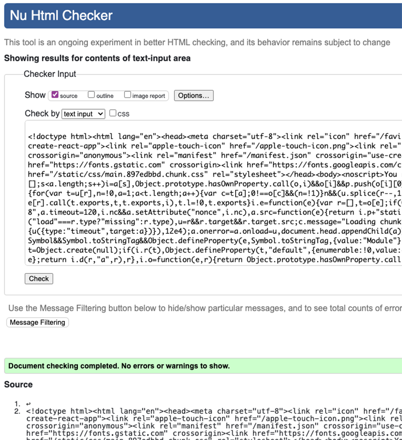

### Jigsaw CSS Validator

No errors were found when passing through the official Jigsaw validator.

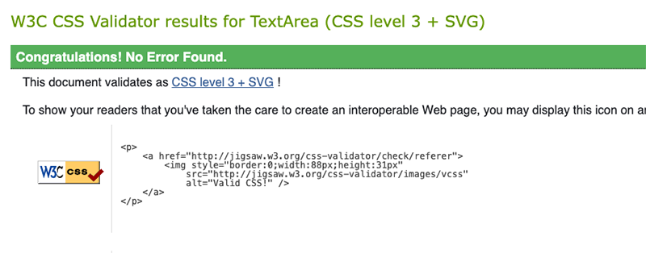

### Javascript 

!!!!  ASK DAISY !!!!

### Python Validator

No errors when passing through Code Institute PEP8 Python Linter.

## Accessibility Testing
### Lighthouse

In order to test performance and accessibility, I used Lighthouse within the Chrome Developer Tools.

#### Home

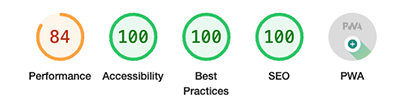

#### Adverts

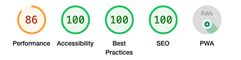

#### Advert Detail

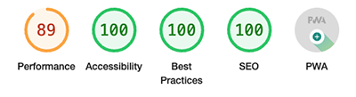

#### Edit Advert

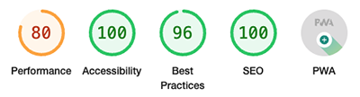

#### Create Advert

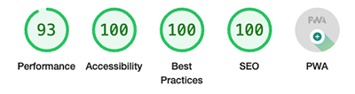

#### Profile

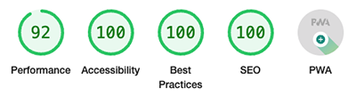

#### Edit Profile

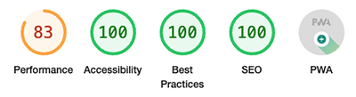

#### Sign Up

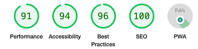

#### Login

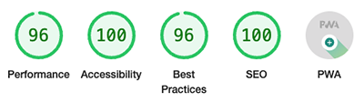

## Bugs

- When trying to display the adoption requests on the advert detail page, I encountered an issue where the name would be shown but there was a blank avatar next to it, and when clicked on, it did not show the profile.  I discovered that whilst it was showing the correct adoptee, it was actually displaying the results from the api/adoptors endpoint rather than the profile itself. This was rectified by looping over the adoptor data and finding the corresponding profiles and updating the profile state accordingly.
- When setting up the adverts section I had created an advert context file.  When it came to implementing the search feature, it wouldn't work correctly, it wouldn't fetch the results and I was finding it difficult to pass the query parameter to the context file. Having discussed the issue with tutor support it was decided that the best way forward would be to delete the context file and follow the steps in the walkthrough Moments project to set up the search feature. 

Back to [README.MD](README.MD)